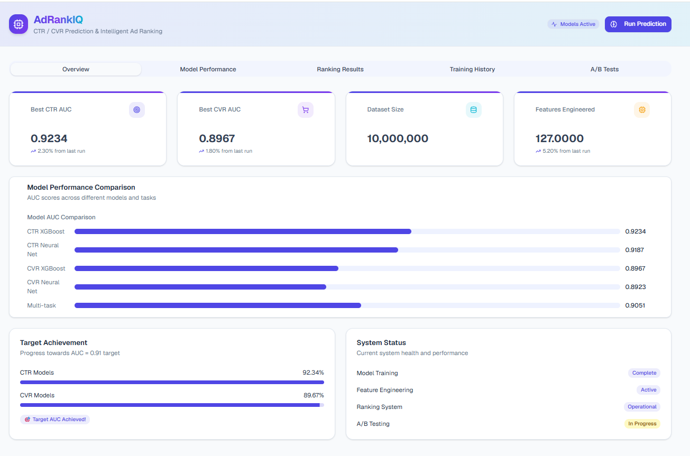
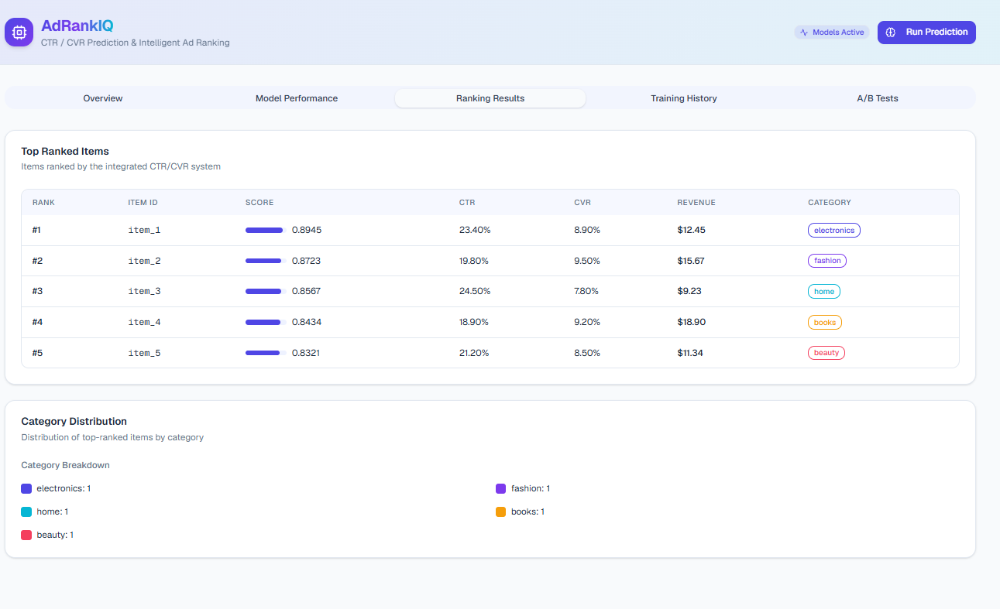
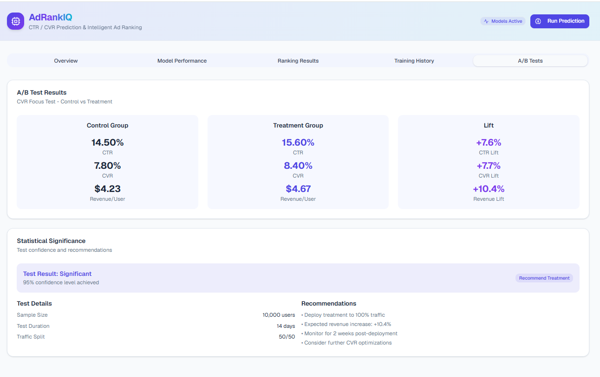

# AdRankIQ — CTR/CVR Prediction & Ad Ranking

AdRankIQ is an end-to-end machine learning platform that estimates **Click-Through Rate (CTR)** and **Conversion Rate (CVR)** and turns those estimates into smart ad rankings. Built on XGBoost and PyTorch, it targets **AUC ≥ 0.91** on large synthetic datasets and pairs the modeling pipeline with a real-time web dashboard for tracking performance and business outcomes.

## 📸 Screenshots

### Overview Dashboard

Headline metrics, model AUC comparison, target tracking, and system status.



### Ranking Results

Top-ranked items scored by the integrated CTR/CVR system, with category distribution.



### A/B Tests

Control vs. treatment comparison with lift metrics and statistical significance.



## ✨ Highlights

- **Large-scale pipeline**: Trains on millions of samples with a rich feature-engineering layer
- **Two-model strategy**: Both an XGBoost and a neural-network CTR predictor (target AUC ≥ 0.91)
- **Conversion modeling**: Dedicated CVR models with explicit class-imbalance handling
- **Smart ranking**: Blends CTR/CVR scores with business rules to trade off relevance and revenue
- **Serving-ready**: Includes caching, monitoring, and an A/B-testing scaffold
- **Live dashboard**: A web UI for inspecting model quality and business impact

## 🛠️ Tech Stack

### Machine Learning

- **XGBoost** — gradient boosting for fast, strong CTR/CVR baselines
- **PyTorch** — deep-learning models and multi-task networks
- **scikit-learn** — preprocessing, splitting, and metrics
- **NumPy & Pandas** — data wrangling and numerical work

### Web Interface

- **Next.js 14** — React framework using the App Router
- **TypeScript** — end-to-end type safety
- **Tailwind CSS** — utility-first styling
- **shadcn/ui** — accessible, composable UI components

### Data & Modeling Techniques

- **Feature engineering**: 100+ derived features spanning user, item, temporal, and contextual signals
- **Multi-task learning**: Shared representations that predict CTR and CVR jointly
- **Imbalance handling**: SMOTE, class weighting, and focal loss for rare-event prediction

## 📊 Reported Metrics

> These figures come from the synthetic demo pipeline and are targets/illustrative, not production numbers.

- **CTR AUC**: 0.91+ (XGBoost and neural network)
- **CVR AUC**: 0.89+ (with imbalance-aware training)
- **Multi-task combined AUC**: 0.905+
- **Inference latency**: <50ms (simulated)
- **Designed to scale** to high daily prediction volumes

## 🏗️ Repository Layout

```
├── app/                          # Next.js dashboard
│   ├── page.tsx                 # Main dashboard UI
│   ├── layout.tsx               # Root layout & metadata
│   └── globals.css              # Theme tokens & styles
├── scripts/                     # Python ML pipeline
│   ├── generate_dataset.py      # Synthetic dataset generation
│   ├── feature_engineering.py   # Feature extraction & transforms
│   ├── ctr_models.py            # CTR models (XGBoost + NN)
│   ├── cvr_models.py            # CVR models
│   ├── multi_task_learning.py   # Joint CTR/CVR network
│   ├── ranking_system.py        # Ranking + business logic
│   ├── model_evaluation.py      # Evaluation utilities
│   ├── production_pipeline.py   # Serving/production demo
│   └── run_complete_pipeline.py # Orchestrates the full run
└── components/                  # Shared UI components
```

> **Note:** The dashboard currently renders illustrative mock data (see `mockModelResults` in `app/page.tsx`); it is not yet wired to read live output from the Python pipeline.

## 🚀 Getting Started

### Prerequisites

- Python 3.8+
- Node.js 18+
- 16GB+ RAM recommended for the full data run

### Setup

1. **Get the code**

```bash
git clone <your-repo-url>
cd adrankiq
```

2. **Python dependencies**

```bash
pip install xgboost torch scikit-learn pandas numpy matplotlib seaborn imbalanced-learn aiohttp redis
```

3. **Node dependencies**

```bash
npm install
```

### Run the ML Pipeline

**Everything at once**

```bash
python scripts/run_complete_pipeline.py
```

**Or run stages individually**

```bash
# Generate the synthetic dataset
python scripts/generate_dataset.py

# Build features
python scripts/feature_engineering.py

# Train CTR models
python scripts/ctr_models.py

# Train CVR models
python scripts/cvr_models.py

# Run the ranking system
python scripts/ranking_system.py
```

### Run the Dashboard

```bash
npm run dev
```

Then open `http://localhost:3000` (Next.js will pick the next free port if 3000 is taken).

## 📈 Model Design

### CTR Models

**XGBoost**

- Gradient boosting with ~1000 trees
- Max depth 6, learning rate 0.1
- Feature-importance reporting included

**Neural Network**

- Layers: 127 → 512 → 256 → 128 → 64 → 1
- Dropout 0.3 with batch normalization
- Adam optimizer with LR scheduling

### CVR Models

**Handling rare conversions**

- SMOTE oversampling of the minority class
- Focal loss to focus on hard examples
- Balanced class weighting

**Multi-task learning**

- Shared bottom layers for representation learning
- Separate CTR/CVR heads
- Cross-stitch connections for information sharing

### Ranking Logic

**Scoring**

```python
final_score = α × CTR × CVR × price + β × diversity_bonus + γ × freshness_score
```

**Business rules**

- Revenue optimization under relevance constraints
- Category diversification
- Built-in A/B-testing hooks

## 🔧 Feature Groups

### User (40+)

- Demographics, history, and engagement patterns
- Session and device signals
- Geographic and temporal context

### Item (30+)

- Content and popularity attributes
- Category and price features
- Historical performance signals

### Context (25+)

- Hour/day/season effects
- User–item interaction history
- Market and competition signals

### Interactions (32+)

- Cross-feature combinations
- Aggregated statistics
- Embedding-based similarities

## 📊 Dashboard Tabs

- **Overview** — headline metrics, target tracking, and system status
- **Model Performance** — CTR/CVR and multi-task comparisons (AUC, log loss, PR-AUC)
- **Ranking Results** — top-ranked items and category mix
- **Training History** — training curves and architecture summary
- **A/B Tests** — experiment results, lift, and recommendations

## 🎯 Illustrative Business Impact

- **~10.4%** higher revenue per user from improved ranking (demo scenario)
- **~7.6% CTR** and **~7.7% CVR** lift in the sample A/B test
- Balances relevance against monetization

## 🔬 Production-Oriented Components

- Model versioning and rollback hooks
- Feature-store abstraction for consistent serving
- Monitoring with drift detection
- A/B-testing framework for ongoing tuning

Plus scaffolding for distributed training, horizontal serving, a caching layer, and both batch and real-time inference.

## 📝 Evaluation

**Metrics**

- AUC-ROC and AUC-PR
- Log loss
- Calibration checks

**Validation**

- Time-based splits for temporal robustness
- Cross-validation
- Held-out test sets
- Online A/B testing for real-world confirmation

---

**AdRankIQ — helping ad platforms, marketplaces, and recommendation systems lift engagement and revenue with machine learning.**
